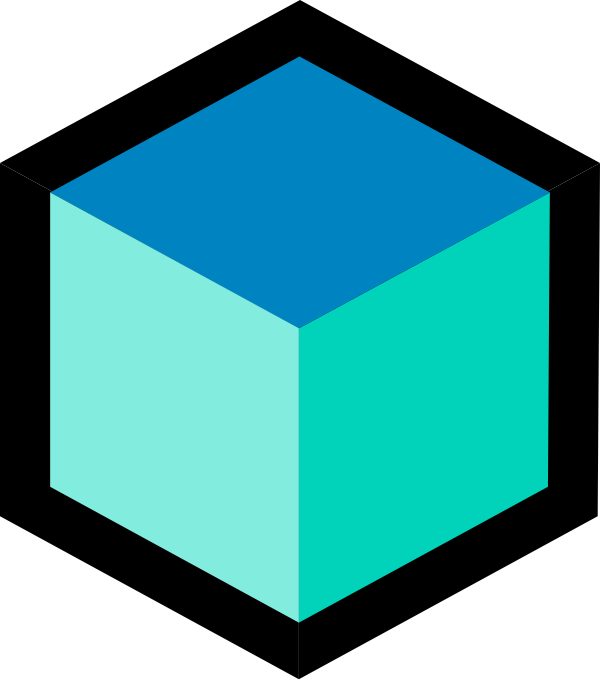

</img>

# Flutter Icons
----
You're `vscode extension` that display a large gam of icons for a clean architecture of you're Flutter project !

<a href="https://marketplace.visualstudio.com/items?itemName=AntoineGtr.flutter-icons">Click here to install</a>

|   After   |   Before  |
|------|------|
||||

---

## Device Folder

|   Windows Folder   |   Linux Folder   |   MacOS Folder   |    iOS Folder  |
|------|------|------|------|
||||
|  |  |  |  |
---
## Provider Folder

|   Bloc Folder   |   Mobx Folder   |   Riverpod Folder   |    Getx Folder  |
|------|------|------|------|
||||
|  |  |  |  |
---
## Extensions Dart

|   Classic File   |   Services File   |   Module File   |    State File   |
|------|------|------|------|
||||
---
## Provider File

|   Bloc File   |   Mobx File   |   Riverpod File   |    Getx File   |
|------|------|------|------|
||||
---
## Config File

|   .metadata   |   .flutter-plugins   |   .flutter-plugins-dependencies   |    .dart_tool   |
|------|------|------|------|
||||
---
## Contributing

Feel free to create read the <a href="https://github.com/Antoinegtir/flutter-icons/contributing.md">Contributing</a> if you wanna add some flutter icons that i might forgot !

## Credits

All Folders & Files at the top are created and implemented on the extensions by @Antoinegtir using Procreate software. If you like this extension do not hesitate to help us by staring the repo, we wanna that this extension became the flutter icon reference for helping people ❤️.

The rest of the files & folder come from the following beautyfull library: <a href="https://github.com/PKief/vscode-material-icon-theme">Material Icon Theme</a> they create an awesome work !

## Cookbook 📖

Check the following <a href="">Wiki</a> if you wanna run locally the extension and start developping you're own !

## License

MIT license, see `LICENSE`.
